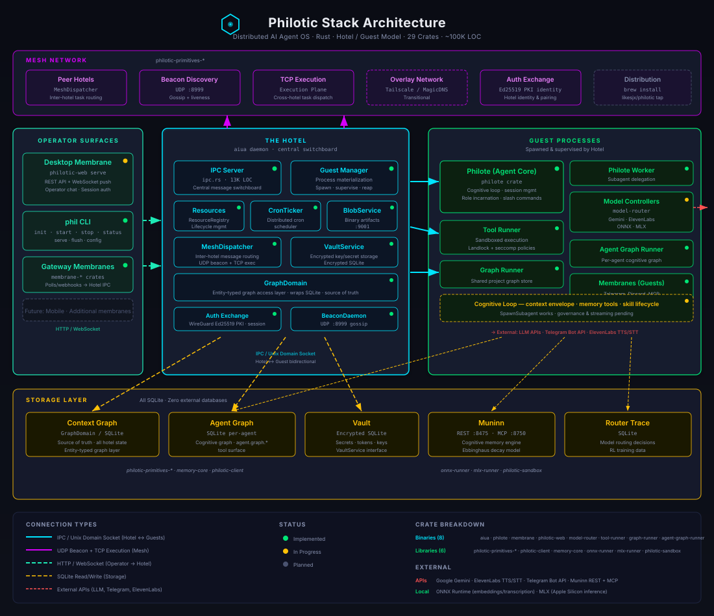
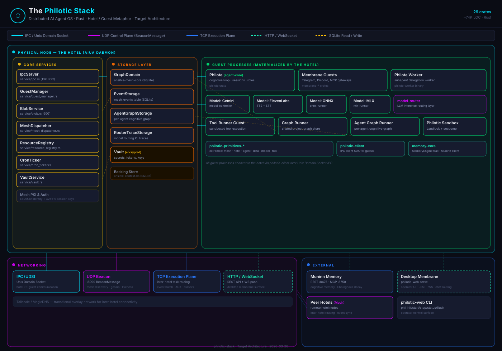
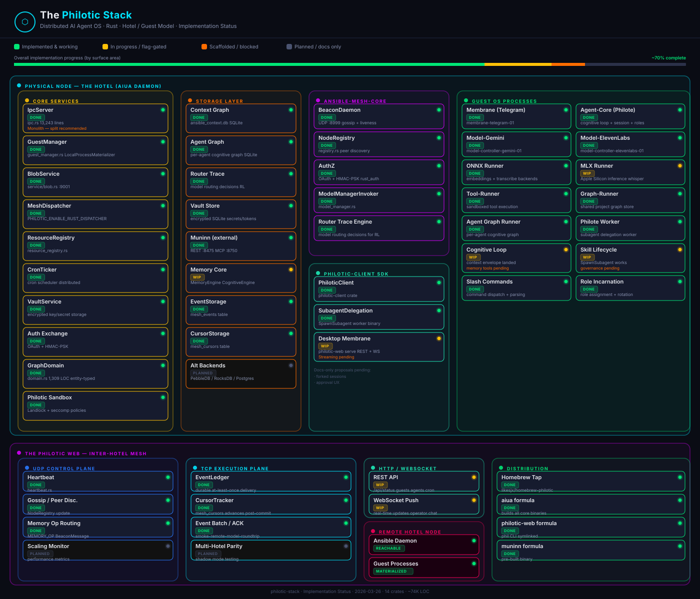

# The Philotic Stack

A distributed AI agent operating system built in Rust — modeled after the "Ansible" and "Philotic Web" metaphors from _Speaker for the Dead_.

Each hotel is an autonomous, Rust-powered node that materializes AI guest processes, persists state in a local Context Graph, and communicates with peer hotels over a durable UDP mesh.

[](https://youtu.be/SF2C9rbz330)

## Installation

### Homebrew (macOS)

```bash
brew tap likesjx/philotic
brew install philotic-web    # installs the operator CLI + all core binaries
brew install muninn          # installs the cognitive memory store
```

This installs the `phil` CLI (symlinked from `philotic-web`), the `aiua` hotel daemon, and all guest binaries (philote, membrane, model-router, tool-runner, graph-runner).

### From Source

```bash
git clone https://github.com/likesjx/philotic-stack.git
cd philotic-stack
cargo build --release
```

Binaries are built to `target/release/`. The primary ones:

| Binary | Purpose |
|---|---|
| `aiua` | Hotel daemon — materializes and supervises all guests |
| `philotic-web` | Operator CLI (`phil init`, `phil start`, `phil status`) |
| `philote` | Agent core — cognitive loop, sessions, roles |
| `membrane` | Telegram gateway |
| `model-router` | LLM inference routing |
| `tool-runner` | Sandboxed tool execution |

## Quick Start

```bash
# After installation:
phil init                    # generate identity keypair + mesh-config.json
phil start                   # start the hotel daemon (materializes all agents)
phil status                  # check running agents
phil agents                  # list configured agents
```

Or manually:
```bash
cp mesh-config.example.json mesh-config.json
# Edit mesh-config.json with your API keys and node identity
aiua --load-config mesh-config.json
```

## Architecture Diagrams

### Architecture Overview



### Target Architecture



### Implementation Status



> **Legend** — 🟢 Implemented · 🟡 In progress / flag-gated · 🟠 Scaffolded / blocked · ⚫ Planned / docs only

## Crates

29 crates.

### Binaries

| Crate | Role |
|---|---|
| [`aiua`](crates/aiua/) | Hotel daemon — guest materialization, IPC server, mesh routing |
| [`philote`](crates/philote/) | Agent core — cognitive loop, session management, role incarnation |
| [`membrane`](crates/membrane/) | Transitional wrapper over membrane runtime |
| [`membrane-telegram`](crates/membrane-telegram/) | Telegram / external protocol gateway |
| [`membrane-discord`](crates/membrane-discord/) | Discord gateway |
| [`membrane-mcp`](crates/membrane-mcp/) | MCP gateway |
| [`philotic-web`](crates/philotic-web/) | Operator CLI + desktop membrane (REST API, WebSocket, operator chat) |
| [`model-router`](crates/model-router/) | Shared LLM inference routing SDK |
| [`tool-runner`](crates/tool-runner/) | Sandboxed tool execution (Landlock + seccomp via philotic-sandbox) |
| [`graph-runner`](crates/graph-runner/) | Shared project graph store |
| [`agent-graph-runner`](crates/agent-graph-runner/) | Per-agent cognitive graph (`agent.graph.*` tool surface) |
| [`graph-datasource`](crates/graph-datasource/) | Autonomous graph partition management tool surface |
| [`graph-intelligence`](crates/graph-intelligence/) | Project intelligence graph + MCP server |

### Libraries

| Crate | Role |
|---|---|
| [`ansible-mesh-core`](crates/ansible-mesh-core/) | Legacy monolith (in process of being extracted into primitives) |
| [`philotic-primitives-mesh`](crates/philotic-primitives-mesh/) | Mesh primitives (EventEnvelope, BeaconMessage, etc.) |
| [`philotic-primitives-hotel`](crates/philotic-primitives-hotel/) | Hotel orchestration primitives |
| [`philotic-primitives-agent`](crates/philotic-primitives-agent/) | Agent and persona primitives |
| [`philotic-primitives-data`](crates/philotic-primitives-data/) | Data and storage primitives |
| [`philotic-primitives-model`](crates/philotic-primitives-model/) | Model routing and context primitives |
| [`philotic-primitives-tool`](crates/philotic-primitives-tool/) | Tool execution primitives |
| [`philotic-client`](crates/philotic-client/) | Guest SDK — IPC client for hotel communication |
| [`memory-core`](crates/memory-core/) | MemoryEngine trait, CognitiveEngine, Muninn integration |
| [`philotic-graph`](crates/philotic-graph/) | Core graph intelligence and SVE tooling |
| [`datasource`](crates/datasource/) | SQLite partition and datasource management |
| [`onnx-runner`](crates/onnx-runner/) | Local ONNX inference (embeddings, transcription) |
| [`mlx-runner`](crates/mlx-runner/) | Local MLX inference (Apple Silicon) |
| [`philotic-sandbox`](crates/philotic-sandbox/) | Secure execution sandbox (Landlock + seccomp policies) |
| [`media-prep`](crates/media-prep/) | Media processing and preparation |

## The Agent Fleet

The default Philotic stack materializes a fleet of specialized agents, each with a distinct persona and mission:

- **Jane (The Assistant)**: Warm, capable, and direct. Your primary point of contact for daily help.
- **Aria (The Architect)**: Technical lead and development specialist. Manages the stack itself.
- **Beacon (The Chief of Staff)**: Keeper of goals, projects, and commitments. Ensures clarity and focus.
- **Hermes (The Communicator)**: Specialized in routing, summaries, and correspondence.
- **Astrid (The Librarian)**: Archivist of knowledge and organization. Manages documentation and vault systems.

## Key Design Principles

- **Hotel = source of truth.** The Context Graph SQLite DB owns all state.
- **Security first, especially at the perimeter.** External communication surfaces default to minimal trust and explicit policy.
- **IPC for intra-hotel.** All local communication uses Unix Domain Sockets (`/tmp/philotic-aiua.sock`).
- **Mesh for inter-hotel.** Cross-machine coordination uses UDP Gossip/Beacons (Control Plane) and TCP Exec-Transport (Data Plane), secured by a WireGuard-inspired Ed25519 PKI identity and ephemeral X25519 session keys.
- **GraphDomain is the access layer.** Entity-typed graph methods enforce naming conventions and reduce raw SQL surface area.
- **Guests are crash-safe.** The supervisor loop auto-respawns dead guests every 5s.
- **Memory is eventually consistent.** Guests write optimistically; the hotel resolves conflicts via Last-Writer-Wins.

## Documentation

- **[Full Architecture Reference](docs/architecture/ARCHITECTURE.md)** — system design, data flows, component reference.
- **[Architecture Status](docs/architecture/ARCHITECTURE_STATUS.md)** — live status of implemented vs. transitional features.
- **[Domain Map](docs/architecture/DOMAIN_MAP.md)** — architectural domains and their governing proposals.
- **[Seam Registry](docs/architecture/SEAM_REGISTRY.md)** — all registered implementation seams.

## License

MIT
