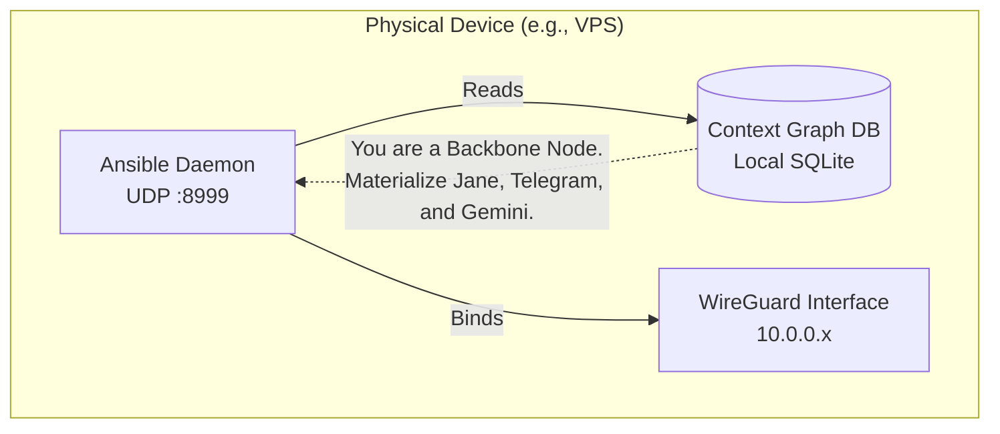
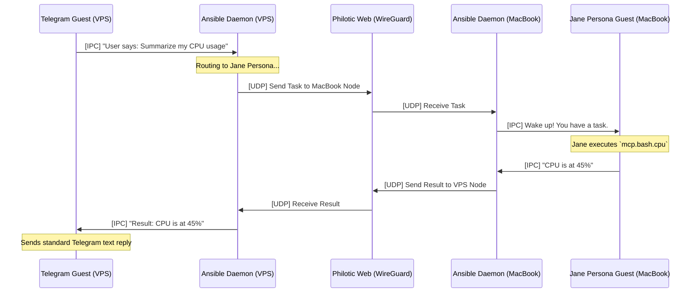
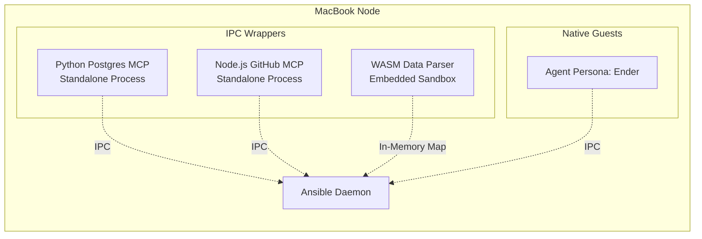

# The Philotic Web Architecture

> **Historical Document:** This file captures an earlier ZeroClaw-to-Philotic architectural framing and should not be treated as the current source of truth.
>
> For current architecture truth, start with [docs/architecture/ARCHITECTURE_STATUS.md](/Users/jaredlikes/code/philotic-stack/docs/architecture/ARCHITECTURE_STATUS.md), [docs/architecture/DOMAIN_MAP.md](/Users/jaredlikes/code/philotic-stack/docs/architecture/DOMAIN_MAP.md), and [docs/architecture/ARCHITECTURE.md](/Users/jaredlikes/code/philotic-stack/docs/architecture/ARCHITECTURE.md).

ZeroClaw utilizes a **Universal Materialization** architecture entirely decoupled by a mesh network (the _Philotic Web_). The core paradigm is simple: **ZeroClaw itself does nothing.** It is purely an empty host—a stargate—that spawns independent OS processes to perform work based on its assigned configuration.

## 1. The Local Hotel (The Ansible Daemon)

Every physical device (a MacBook, a VPS, an iOS device) runs exactly one **Ansible Daemon** (`zeroclaw mesh run`). This daemon is the "Hotel Manager".



## 2. Universal Materialization (The Guests)

> **CORE PRINCIPLE: The Context Graph is the Absolute Source of Truth**
>
> As a rule, all state must be maintained exclusively in the Context Graph. The Graph is an exact, deterministic mirror of the active Hotel's desired state. The Ansible Daemon does not invent or hold ephemeral configuration in memory; its single job is to read the Graph.
>
> **State structure must change prior to materialization.** The materialization or termination of OS Guest Processes is purely a side-effect driven by the Hotel's state in the Context Graph (e.g., flipping `is_active = 1` or tracking an `active_pid`). If the Ansible crashes or is killed, it can boot back up, read the Graph, cleanly assassinate any orphaned OS process holding a `guest_id` lock, and rematerialize the Hotel to perfectly match the Graph.

When the Ansible Daemon boots, it reads the local **Context Graph Database**. The configuration declares the roles this specific node must play.

The Ansible Daemon then **spawns OS processes (The Guests)** for each required capability, effectively executing the state defined in the Graph.

```mermaid
graph TD
    subgraph Ansible Node ["Single Physical Node (e.g. VPS Backbone)"]
        hotel[Ansible Daemon / Hotel Manager<br/>(Event Bus & Mesh Router)]

        %% Guests Spawned by the Hotel
        hotel == Materialize Process ==> g1[Guest 1: Telegram Hegemon<br/>(OS Child Process)]
        hotel == Materialize Process ==> g2[Guest 2: Jane Persona<br/>(OS Child Process)]
        hotel == Materialize Process ==> g3[Guest 3: Gemini Model Router<br/>(OS Child Process)]

        %% Local IPC Communication
        g1 -->|IPC Request| hotel
        hotel -->|IPC Result| g1

        g2 -->|IPC Request| hotel
        hotel -->|IPC Result| g2

        g3 -->|IPC Request| hotel
        hotel -->|IPC Result| g3
    end
```

### The Separation of Concerns:

1. **The Telegram Guest** knows how to poll webhooks, but it doesn't know what to do with the text. It passes it to the Ansible via IPC.
2. **The Jane Persona Guest** knows how to think, but it doesn't know how to talk to Telegram or query Google. It passes requests to the Ansible via IPC.
3. **The Gemini Guest** knows how to make outbound HTTP calls to Google's API natively, but it doesn't generate its own prompts.

## 3. The Philotic Web (The Mesh)

When a Guest sends an IPC message to the local Ansible, the Ansible looks at the destination. If the target Guest lives on _another_ physical machine, the Ansible wraps the payload in a UDP `BeaconMessage` and fires it across the WireGuard network (The Philotic Web).



## 4. MCP Servers & Extensibility

Because everything is just a process communicating over IPC to the local Ansible, **Model Context Protocol (MCP)** servers fit perfectly.

You can write a tiny wrapper in Python or Node.js. It runs as a standalone process, opens an IPC socket to the local Ansible, and registers its tools. To the rest of the Philotic Web, it looks natively built into ZeroClaw.


