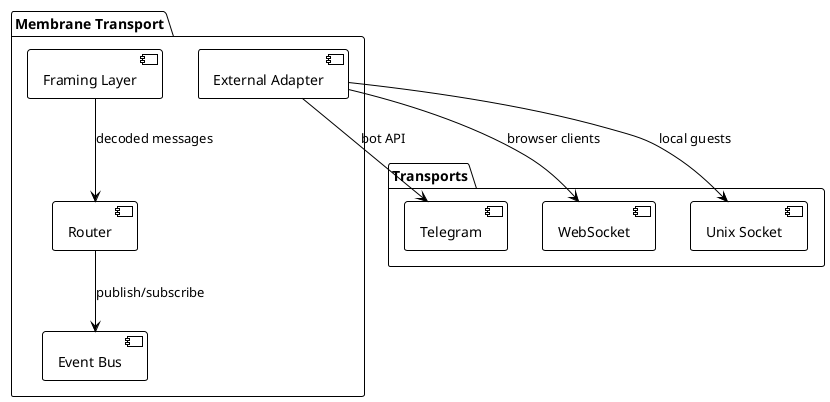
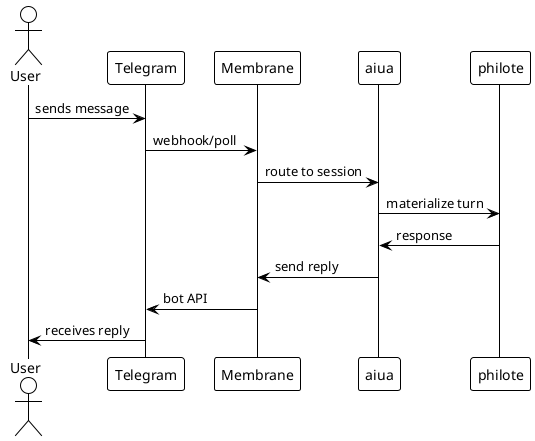
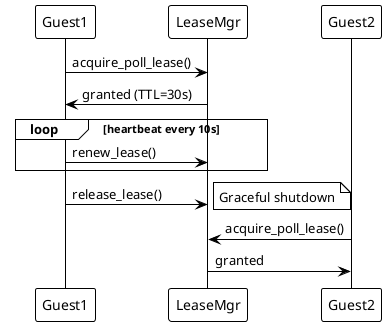

# Membrane Transport Architecture

## Overview

**Membrane** is the IPC and event transport layer for Philotic. It handles:
- Framed message passing between hotel and guests
- External transport (Telegram, WebSocket, etc.)
- Event routing and subscription
- Lease-coordinated poll management



## Core Concepts

### Framing

All IPC uses **explicit framing** with:
- Length-prefixed messages
- Correlation IDs for request/response matching
- Lease context propagation

```rust
// Pseudo-code
struct Frame {
    correlation_id: Uuid,
    lease_id: Option<String>,
    payload: Bytes,
}
```

### Event Bus

Publish/subscribe system for:
- Session state changes
- Lease acquisitions/releases
- External message arrival
- System health events

### External Adapters

Pluggable adapters for external systems:
- **Telegram**: Bot API with poll lease coordination
- **WebSocket**: Browser UI real-time updates
- **Unix**: Local guest process communication

## Telegram Integration



### Poll Lease Protocol

Critical for avoiding double-processing:

1. Guest acquires poll lease
2. Lease has TTL (e.g., 30s)
3. Guest must heartbeat or release
4. If lease expires, another guest can take over



## Implementation

### Key Crates

- `membrane/` — Transport layer
- `membrane/src/framing.rs` — Frame codec
- `membrane/src/telegram.rs` — Telegram adapter
- `membrane/src/event_bus.rs` — Event routing

### Critical Files

- `membrane/src/lease_aware_poll.rs` — Poll lease coordination
- `membrane/src/external_adapter.rs` — Adapter trait
- `membrane/src/router.rs` — Message routing

## Active Seams

- `seam:telegram-poll-lease` — Poll lease implementation
- `seam:active-membrane-routing` — Live routing
- `seam:handoff-skill` — Graceful guest handoff

## Related Proposals

- [MEMBRANE_COMPONENT_PROPOSAL](../architecture/MEMBRANE_COMPONENT_PROPOSAL.md)
- [TELEGRAM_POLL_LEASE_PROPOSAL](../architecture/TELEGRAM_POLL_LEASE_PROPOSAL.md)
- [TELEGRAM_INTEGRATION_PROPOSAL](../architecture/TELEGRAM_INTEGRATION_PROPOSAL.md)

---

**Status:** Draft — extracting from implemented patterns  
**Next:** Add detailed framing protocol spec
