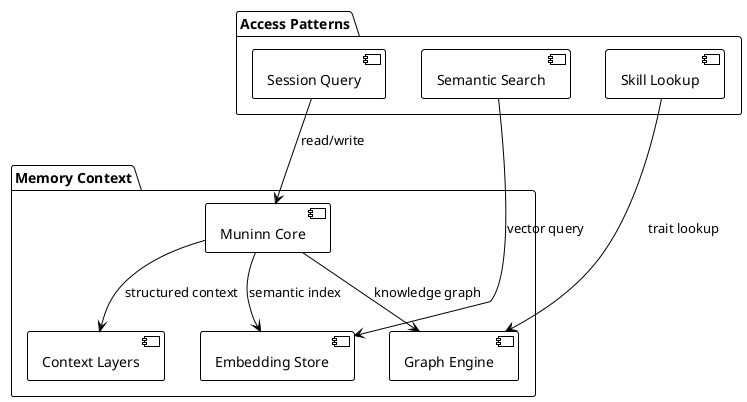
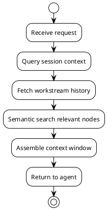

# Memory Context Architecture

## Overview

**Muninn** is the memory and context system for Philotic. It provides:
- Persistent context across sessions
- Semantic search via embeddings
- Structured memory layers
- Graph-backed knowledge

## Core Concepts

### Context Layers

Memory is organized in layers:

| Layer | Scope | Persistence | Use Case |
|-------|-------|-------------|----------|
| Turn | Single request | Ephemeral | Current parsing |
| Session | One agent session | Hours | Working context |
| Workstream | Multi-session | Days | Project continuity |
| Persistent | Forever | Graph | Long-term knowledge |

### Graph-Backed Knowledge

All durable memory lives in the graph:
- **Proposals** — Architectural decisions
- **Seams** — Active work boundaries
- **Tasks** — Tracked work items
- **Code nodes** — Types, functions, modules

### Embeddings

Semantic search powered by:
- Document embeddings (proposals, architecture)
- Code embeddings (functions, types)
- Hybrid search (keyword + semantic)

## Context Assembly

### Assembly Rules

1. **Recency** — Recent activity weighted higher
2. **Relevance** — Semantic similarity to query
3. **Authority** — Verified > Implemented > Proposed
4. **Size limits** — Trim by least relevant

## Graph Intelligence

The `graph-intelligence` crate provides:
- Node/edge storage with embeddings
- Semantic search API
- C4 model navigation
- Proposal tracking

### Key Endpoints

- `POST /mcp` — MCP tool execution
- `GET /api/nodes` — Node listing
- `GET /api/search?q=...` — Semantic search
- `GET /api/proposals/:id/content` — Document retrieval

## Implementation

### Key Crates

- `muninn/` — Memory core
- `agent-graph-runner/` — Context assembly
- `graph-intelligence/` — Graph storage & search

### Critical Files

- `muninn/src/context.rs` — Context layer management
- `muninn/src/embedding.rs` — Embedding generation
- `graph-intelligence/src/server/mcp.rs` — MCP tools

## Active Seams

- `seam:embeddings-intel-graph-ui` — UI implementation
- `seam:graph-domain-migration` — Domain organization
- `seam:context-graph-runner` — Context assembly

## Related Proposals

- [MUNINN_MEMORY_PROTOCOL_PROPOSAL](../architecture/MUNINN_MEMORY_PROTOCOL_PROPOSAL.md)
- [EMBEDDINGS_IN_GRAPH_PROPOSAL](../architecture/EMBEDDINGS_IN_GRAPH_PROPOSAL.md)
- [MEMORY_DURABILITY_PROPOSAL](../architecture/MEMORY_DURABILITY_PROPOSAL.md)

---

**Status:** Draft — extracting from implemented patterns  
**Next:** Add context assembly sequence diagram
