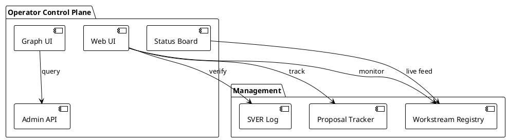

# Operator Control Plane Architecture

## Overview

The **Operator Control Plane** provides visibility and control over the Philotic system:
- Web UI for workstream monitoring
- Admin surface for configuration
- Approval flows for sensitive operations
- Workstream tracking and SVER management



## Core Concepts

### Workstream Visibility

**Status Board** ("The Pitt" style):
- Live agent sessions
- Proposal tracking
- Alert levels (Stable, Attention, Critical)
- Seam coverage

**Key Metrics**:
- Active sessions per proposal
- Verification levels (test/smoke/live)
- Files touched, lines changed
- Time since last activity

### Admin Surface

Configuration and control for:
- Guest materialization policy
- Model routing rules
- Transport adapters
- Lease timeouts

### Approval Flows

Sensitive operations requiring operator approval:
- Code push to protected branches
- Guest binary deployment
- Configuration changes
- Lease override (emergency)

## Web UI

The `graph-intelligence` UI provides:

| View | Purpose |
|------|---------|
| Dashboard | Overview of active work |
| Proposals | Track disposition, view markdown |
| Seams | Active work boundaries |
| Tasks | Work item tracking |
| Status Board | Live workstream monitoring |

### Status Board Layout

```
┌─────────────────────────────────────────────────────────────┐
│  Alert  |  Proposal          |  Seam               | Agent  │
├─────────────────────────────────────────────────────────────┤
│  🟢     |  EMBEDDINGS        |  embeddings-ui      | agent1 │
│  🟡     |  WORKFLOW          |  session-protocol   | agent2 │
│  🔴     |  (no proposal)     |  orphan-seam        | —      │
└─────────────────────────────────────────────────────────────┘
```

Alert levels:
- 🟢 **Stable** — Active session, coding/testing phase
- 🟡 **Attention** — Session in "started" phase (stuck)
- 🔴 **Critical** — Seam with no active session

## SVER Integration

**System Verification and Release** tracking:

Every workstream records:
- `test-green` — Unit/integration tests pass
- `smoke-green` — Binary smoke tests pass
- `watched-live-green` — Live observation confirmed

Verification is cumulative and mandatory for runtime changes.

### Session Close Protocol

```
session_close(
  session_id: "session:...",
  status: "completed",
  verified: "watched-live-green",
  summary: "What was done"
)
```

## Implementation

### Key Components

- `crates/graph-intelligence/ui/` — Web UI (vanilla JS)
- `crates/graph-intelligence/src/server/api.rs` — HTTP API
- `crates/graph-intelligence/src/server/mcp.rs` — MCP tools

### MCP Tools for Operators

- `session_start` — Begin tracked work
- `session_activity` — Log progress
- `session_close` — Complete with verification
- `graph_update_node` — Update status/tags

## Active Seams

- `seam:workstream-graph-audit` — Graph maintenance
- `seam:control-plane-admin-surface` — Admin UI
- `seam:approval-ux` — Approval workflows

## Related Proposals

- [AGENT_WORKSTREAM_TRACKING_PROPOSAL](../architecture/AGENT_WORKSTREAM_TRACKING_PROPOSAL.md)
- [CONTROL_PLANE_ADMIN_SURFACE_PROPOSAL](../architecture/CONTROL_PLANE_ADMIN_SURFACE_PROPOSAL.md)
- [APPROVAL_UX_PROPOSAL](../architecture/APPROVAL_UX_PROPOSAL.md)

---

**Status:** Draft — extracting from implemented patterns  
**Next:** Add admin API endpoint documentation
