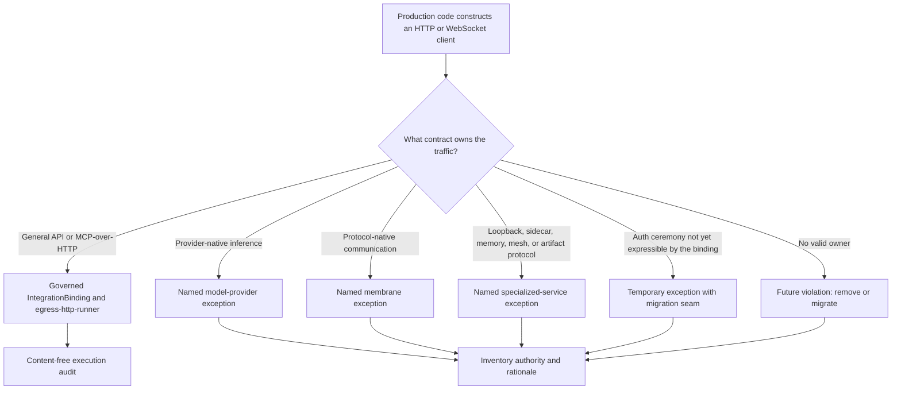
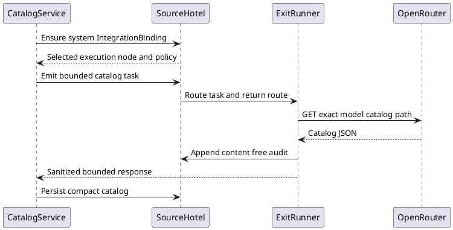
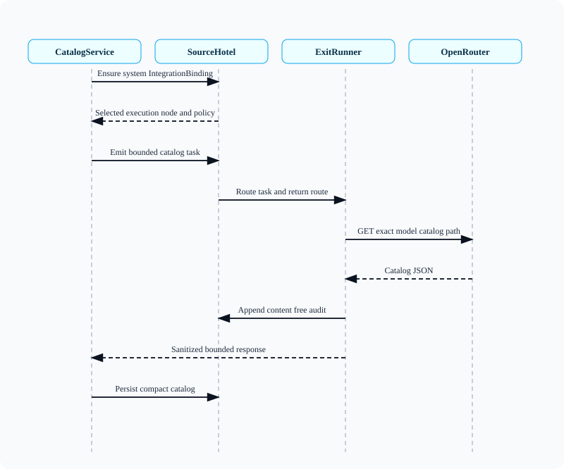

# Outbound Egress Inventory and Classification

This seam is the current classification of production Rust network clients.
The human-readable policy lives here; the exact file-level inventory lives in
[`outbound-egress-inventory.json`](outbound-egress-inventory.json), and
`just outbound-egress-check` prevents an unclassified direct client from
landing unnoticed.

## Classification Rule

Every direct network constructor must have one disposition:

`named-exception` does not mean ambient permission. It means a narrower
protocol owner already exists and is named. A new caller does not inherit that
exception merely because it lives in the same crate.

## Current Inventory

| Family | Traffic class | Current disposition | Authority |
|---|---|---|---|
| `egress-http-runner` | general API | controlled boundary | `IntegrationBinding` + `ToolExecutionRoute` |
| OpenRouter model-catalog sync | general API | migrated | system binding `model-catalog-openrouter` |
| Philote OpenRouter catalog fallback | general API | future violation | none; remove after governed catalog rollout proof |
| Operator OAuth/token/userinfo exchanges | general API, model provider | temporary exception | operator auth ceremony; dedicated auth binding still needed |
| Model-router providers and transcription | model provider | named exception | provider/controller contracts |
| Telegram and Discord clients | communication | named exception | membrane leases and transport contracts |
| Muninn, memory, intel-graph, embedding, Ollama, MLX, and ONNX sidecars | local resource | named exception | dedicated datasource/sidecar contracts |
| Hotel blob, edge upload, and router-listener download | artifact, mesh peer | named exception | signed/content-addressed artifact contracts |
| Heal dispatcher probes and local actions | local resource | named exception | heal-dispatcher configuration and local control contracts |

The JSON inventory expands these families to every currently detected file,
including mixed-class files such as hotel IPC.

## First Governed General-API Migration

The `aiua` OpenRouter catalog poll is deliberately the first migration:

- public and read-only;
- no credential;
- one exact `GET /api/v1/models` path;
- bounded response and zero redirects;
- `general-api` traffic class;
- `prefer_hotel(vps-jane)` with explicit local audited fallback;
- system-owned binding, not a model-facing ambient grant.

<!-- plantuml-node-skill:rendered:outbound-egress-inventory-diagram-1:start -->

<!-- plantuml-node-skill:rendered:outbound-egress-inventory-diagram-1:end -->

## Enforcement

`scripts/check-outbound-egress-inventory.py` scans production Rust sources for
direct `reqwest` and WebSocket client construction. It fails when:

- a detected caller is absent from the JSON inventory;
- an inventory entry no longer constructs a direct client;
- a traffic class or disposition is invalid;
- a migrated caller regains a direct client.

The Linux build workflow runs the check before compiling. The scanner is a
guardrail, not a network syscall sandbox; runtime containment remains the
responsibility of runner materialization and host deployment policy.

## Remaining Seams

1. Remove the Philote direct OpenRouter fallback after the governed catalog is
   proven on the installed hotels.
2. Define a credential-safe auth egress contract for OAuth token and userinfo
   exchange before migrating operator auth.
3. Decide whether communication membranes should delegate only their HTTP hop
   to the shared runner without surrendering protocol and lease authority.
4. Add host-level enforcement only after each named exception has an executable
   allow rule; otherwise a firewall would merely turn explicit debt into
   exciting production outages.
