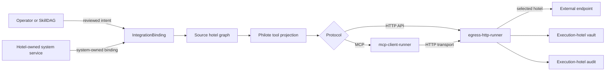
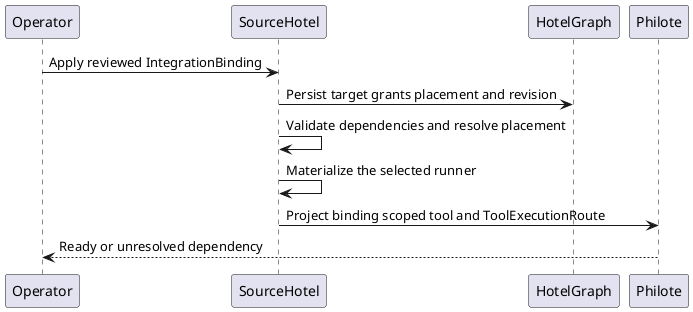
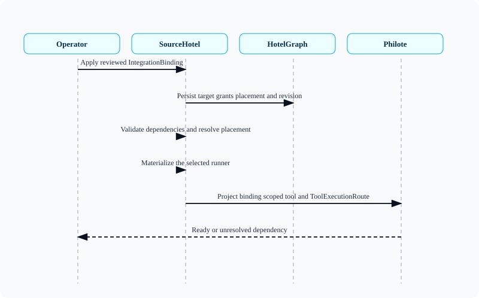
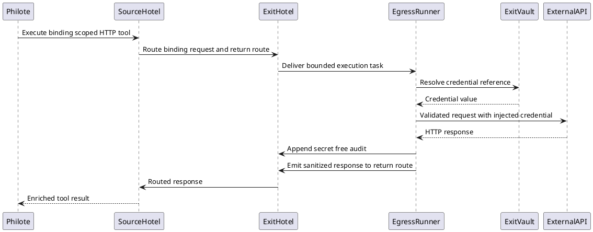
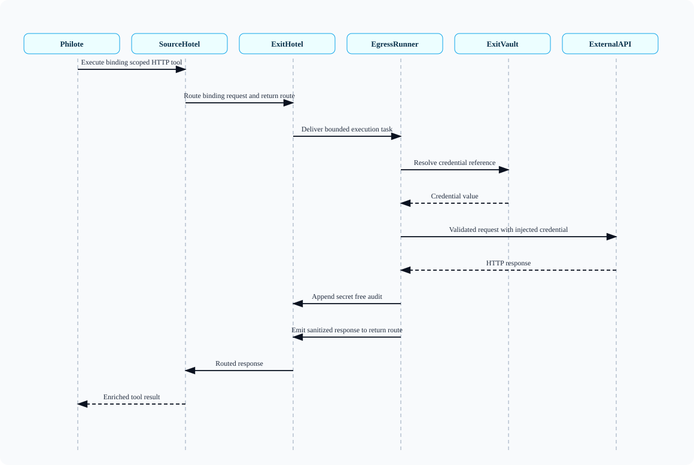
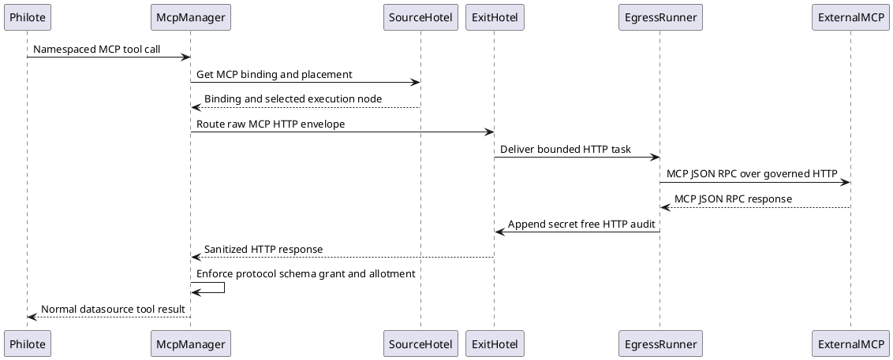
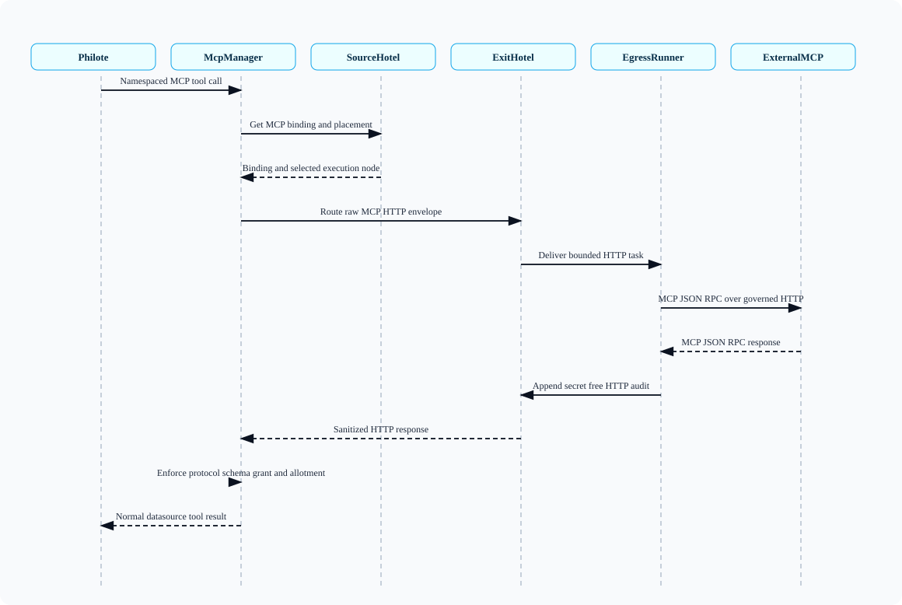
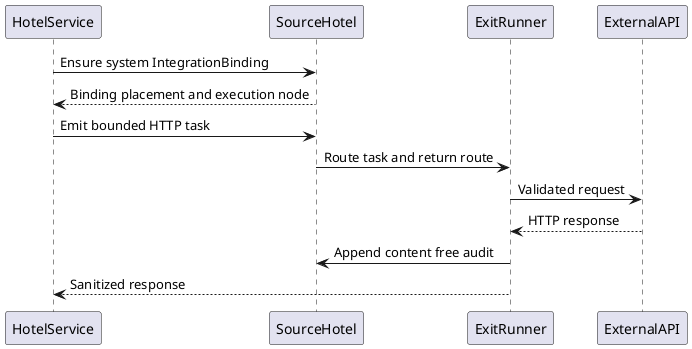
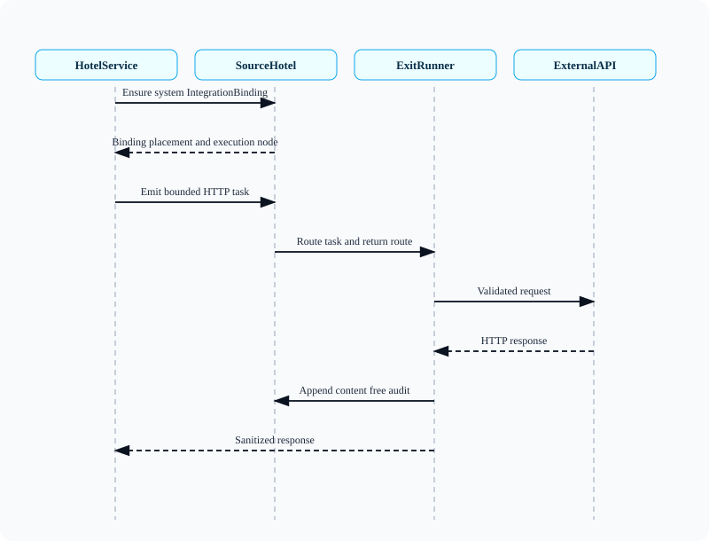

# Governed Outbound Integrations

This is the durable runtime reference for outbound API and MCP execution. It
describes implemented ownership and behavior; the linked proposals retain the
decision history.

## Architecture At A Glance

Philotes do not receive ambient network access. They receive binding-scoped
tools whose execution route is derived from reviewed capability, placement,
and network policy.

The router is the control and placement plane. It does not proxy every outbound
byte. The selected execution hotel materializes the appropriate runner and owns
the final network hop, credential lookup, and content-free audit.

## Authority Map

| Concern | Canonical owner | Boundary |
|---|---|---|
| Desired capability | SkillDAG or operator-authored configuration | Intent only; it is not a live grant |
| Binding, grants, placement, and projection | Source hotel `aiua` graph | Decides whether a tool exists and where it may execute |
| MCP protocol and catalog behavior | `mcp-client-runner` | Owns MCP framing, discovery, schema checks, grants, allotments, and local stdio lifecycle |
| HTTP safety and execution | `egress-http-runner` | Owns request validation, DNS/IP policy, limits, redirects, credential injection, response sanitization, and the network hop |
| Credential value | Vault on the executing hotel | The value does not traverse the mesh or enter graph state |
| Execution audit | Graph on the executing hotel | Records metadata and disposition without request or response bodies |
| Model inference | `model-router` | A separate specialized plane, not a general-purpose egress proxy |

This separation preserves three distinct authorities:

1. **Capability authority** — what the philote may invoke.
2. **Placement authority** — which hotel may perform the invocation.
3. **Bounded-I/O authority** — what may cross the network boundary.

## Binding And Projection Lifecycle

An outbound tool becomes visible only after its dependencies resolve. A
binding names its target, credential references, placement policy, grants, and
resource limits. The source hotel validates that record, resolves a permitted
execution node, and materializes the selected runner before projecting the tool
and its `ToolExecutionRoute`.

<!-- plantuml-node-skill:rendered:outbound-integrations-diagram-1:start -->

<!-- plantuml-node-skill:rendered:outbound-integrations-diagram-1:end -->
The projection is policy, not a passive mirror. Revoked, stale, invalid, or
unresolved bindings are withheld from the model-facing surface.

## Canonical Records And Storage

| Record | Storage key | Purpose |
|---|---|---|
| `IntegrationBinding` registry | `__integration_bindings__` | HTTP targets, grants, placement, credential references, limits, and revision |
| `McpUpstreamConfig` registry | `__mcp_upstreams__` | MCP server definitions, transport, placement, network scope, grants, and limits |
| MCP catalog registry | `__mcp_upstream_catalogs__` | Discovered tool schemas and catalog freshness |
| Integration audit registry | `__integration_audits__` | Content-free execution records on the execution hotel |
| Vault secret | Execution-hotel vault | Credential material referenced by name only |
| `ToolExecutionRoute` | Derived runtime state | Selected execution node, runner role, binding identity, and return route |

HTTP MCP upstreams are also mirrored into `__integration_bindings__` so the MCP
manager and HTTP runner share the same placement and egress contract instead
of growing parallel policy systems.

## Placement Policy

Placement is evaluated per binding. `vps-jane` can be the required exit for a
binding, but it is not a universal transit point.

| Policy | Runtime behavior |
|---|---|
| `local` | Execute on the source hotel only |
| `prefer_hotel` | Use the named hotel; fall back only when the binding explicitly permits it |
| `require_hotel` | Fail closed when the named hotel or runner is unavailable |
| `deny` | Do not project or execute the binding |

The router resolves placement and carries task and return envelopes. It is not
an HTTP byte proxy. Network traffic exits from the hotel selected by the
binding.

## Direct HTTP Execution

Direct API calls use the egress runner without the MCP protocol layer.

<!-- plantuml-node-skill:rendered:outbound-integrations-diagram-2:start -->

<!-- plantuml-node-skill:rendered:outbound-integrations-diagram-2:end -->
The egress runner validates the method and URL, resolves DNS, rejects prohibited
address ranges according to the binding's network scope, enforces redirect,
timeout, and byte limits, injects credentials at the final hop, and sanitizes
the response before it re-enters cognition.

## MCP Client Manager

The MCP manager owns protocol behavior; it does not duplicate the HTTP security
boundary. HTTP MCP transports delegate their raw envelope to the egress runner.
Local stdio MCP transports remain local to the manager and are governed by the
same catalog, grant, and allotment policy.

<!-- plantuml-node-skill:rendered:outbound-integrations-diagram-3:start -->

<!-- plantuml-node-skill:rendered:outbound-integrations-diagram-3:end -->
The philote sees a normal namespaced tool. It does not receive a raw MCP client,
arbitrary endpoint authority, or access to upstream credentials.

## Hotel-Owned System Callers

Hotel-owned services use the same boundary through `GovernedHttpService`.
They connect to the local front desk as named system guests, ensure a
system-owned binding, use the hotel's placement decision, and await the routed
sanitized response. They do not receive a privileged direct-client escape
hatch merely because they run inside `aiua`.

<!-- plantuml-node-skill:rendered:outbound-integrations-diagram-4:start -->

<!-- plantuml-node-skill:rendered:outbound-integrations-diagram-4:end -->

## Failure Semantics

Failures are explicit and do not open a direct-network escape hatch:

- missing, invalid, stale, or ungranted bindings are suppressed or denied;
- `require_hotel` fails closed when its hotel or runner is unavailable;
- `prefer_hotel` falls back only when the binding explicitly allows it;
- an unavailable runner never causes the caller to perform the request itself;
- credential lookup fails before external I/O;
- DNS/IP denial, redirect denial, timeout, and byte-cap violations return
  structured errors;
- stale or incompatible MCP schemas remove the affected tool from projection.

## Audit And Observability

The execution hotel appends the durable audit because it can truthfully attest
to the final network hop and credential boundary. Each record includes binding,
source and execution nodes, runner, target metadata, status, duration, byte
counts, and disposition. It excludes credentials and request/response bodies.

An empty audit view on the source hotel is not evidence that no audit exists;
operators must query `config:__integration_audits__` on the selected execution
hotel.

## Materialization And Deployment

Both runners are ordinary materialized guests:

- `mcp-client-runner` is the outgoing MCP manager;
- `egress-http-runner` is the bounded HTTP execution boundary.

Local control uses hotel IPC. Remote execution uses the mesh task/return path
and the selected hotel's installed runner and vault. Deployment proof therefore
requires more than source tests: the installed binary path, running process,
supervisor restart, selected hotel, vault lookup, external response, return
route, and execution-hotel audit must all be observed from the updated runtime.

## Explicit Exceptions And Classification

Not every socket should be hairpinned through this fabric. Specialized planes
retain their own owners when their contracts are already narrow:

- model-provider inference remains behind `model-router`;
- Telegram and Discord transport remain membrane-owned;
- local MLX, Ollama, Muninn, and sidecar traffic remains local-service traffic.

Everything else must be classified rather than silently grandfathered. The
completed classification seam is recorded in
[OUTBOUND_EGRESS_INVENTORY.md](/Users/jaredlikes/code/philotic-stack/docs/architecture/OUTBOUND_EGRESS_INVENTORY.md).
The machine-checked inventory currently classifies 33 direct-client files and
guards the first migrated caller from regression.

The first general-API migration is the hotel-owned OpenRouter model-catalog
sync. Its `model-catalog-openrouter` system binding permits only credential-free
`GET /api/v1/models`, prefers `vps-jane` with explicit audited local fallback,
and executes through `egress-http-runner`. An isolated binary smoke proves the
binding, runner hop, compact catalog persistence, and durable audit. The
installed two-hotel run additionally proves the `mbp-jane` system caller
resolves and executes at `vps-jane-aiua-01`, receives HTTP 200, and persists
the compact catalog while the content-free audit remains authoritative at the
VPS exit.

The next migrations are removal of the Philote direct catalog fallback and a
dedicated credential-safe auth egress contract. Named model-provider,
communication, local-resource, mesh, and artifact exceptions remain explicit
rather than pretending every socket has identical semantics.
