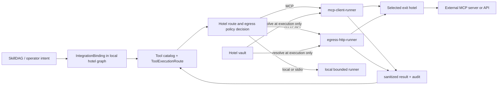

# Outbound Integration Fabric

## Goal

Give philotes governed, data-driven reach to external MCP servers, HTTP APIs,
and installed integrations without embedding service-specific networking or
credentials in the cognitive runtime.

The resulting system must answer, for every outbound capability:

- what integration is bound
- which tools or skills may use it
- which agent and role grants apply
- where the request executes
- which destination and credential policy applies
- what was sent, what returned, and which policy authorized it

## Core Recommendation

Build one outbound integration fabric with three distinct authorities:

1. **SkillDAG and tool management records describe capability.** They compile
   integration bindings, grants, and routes into the local hotel graph.
2. **The hotel routing plane selects an execution location.** It resolves the
   binding and placement policy, then routes work to the selected runner.
3. **A bounded runner performs network I/O.** `mcp-client-runner` owns MCP
   protocol behavior; a new `egress-http-runner` owns general HTTP execution.
   Credentials are resolved only inside the executing hotel boundary.

The router is the control plane, not a byte-forwarding proxy. `model-router`
remains specific to model/provider execution and must not become the universal
network exit merely because it already has "router" in its name.

## Disposition

Accepted for the current slice.

The current slice:

- establishes typed traffic-class and exit-placement decisions
- makes `hotel.egress.check` authorization-only
- stops returning resolved credential headers to a philote/model tool result
- records the real current MCP client implementation and the remaining HTTP
  execution gap

The first runtime proxy, MCP adoption of the shared boundary, and fleet rollout
remain follow-on slices.

## Current Truth

### Proven

- The outbound MCP client manager already exists as
  `membrane-mcp-client` / role `mcp-client-runner`.
- MCP HTTP and stdio transports, upstream registration, tool projection,
  vault-backed credentials, allowlists, limits, and operator policy commands
  are implemented and have scratch-hotel smoke evidence.
- MCP calls use ordinary routed tool execution through
  `ToolExecutionRoute`; there is no bespoke cognitive re-entry path.
- `perimeter-core` defines an `EgressPolicy`, policy evaluation, and
  vault-backed credential binding.
- `aiua` exposes `CheckEgress` and a hotel-owned `HotelEgressGateway`.

### Proven Gap

- The current hotel egress surface checks policy but does not execute HTTP.
- Direct HTTP clients remain distributed across membranes, MCP, models, memory,
  graph, web, and other runners.
- Before this slice, `CheckEgress` resolved credentials and returned raw
  injection headers through IPC; `hotel.egress.check` rendered those headers
  into a model-facing tool result.
- MCP-over-HTTP checks its own host allowlist and then executes directly from
  `mcp-client-runner`; it does not yet use the shared perimeter executor.
- The existing MCP client fabric is not proven deployed across production
  hotels.

### Intended

- General API and MCP-over-HTTP requests execute through a shared,
  hotel-owned HTTP egress runner.
- `vps-jane` is the normal Internet exit for selected integration classes,
  subject to health, trust, latency, and explicit fallback policy.
- SkillDAG bindings compile to local graph records so runtime resolution does
  not depend on remote LifeGraph availability.

## Answer: Should All Traffic Exit Through `vps-jane`?

No.

All outbound work should pass through a policy decision, but not all packets
should be hairpinned through one router or one VPS.

Centralizing every byte at `vps-jane` would create:

- a single availability and throughput bottleneck
- needless latency for loopback, LAN, and tailnet-local services
- worse failure behavior during VPS or overlay outages
- authority confusion between model routing, mesh routing, and egress
- an attractive concentration point for credentials and response data

The useful centralized property is **policy and audit consistency**, not
universal physical transit.

## Traffic Placement Matrix

| Traffic class | Default execution | `vps-jane` posture | Fallback |
| --- | --- | --- | --- |
| general Internet API | preferred exit hotel | preferred | local-with-audit only when binding permits |
| credential-bound high-trust API | required exit hotel | normally required | fail closed |
| MCP over public HTTP | preferred or required per upstream | preferred | explicit per-upstream policy |
| MCP loopback / same hotel | local | bypass | fail closed if local service is absent |
| MCP over tailnet to a trusted hotel | selected trusted hotel | optional | explicit alternate or deny |
| Telegram/Discord delivery | transport-home hotel | not forced | membrane-specific retry |
| model/provider calls | current execution hotel | explicit transitional exception | provider routing policy |
| mesh control and state sync | direct peer path | never universal exit | mesh retry/failure semantics |
| local files, sockets, and stdio MCP | local only | never | deny remote substitution |
| large artifact/blob transfer | direct approved endpoint | not a default hairpin | workload-specific |

`vps-jane` is a deployment value, not an architectural singleton. Policy names
an exit-hotel identity/capability; placement resolves that to the current hotel.

## Authority And Data Flow



The graph stores references and policy, not bearer material. Routed task
envelopes carry binding IDs and request data, not resolved credentials.

## Canonical Records

### `IntegrationBinding`

The tool-management plane should own a data record with at least:

```text
binding_id
kind: http_api | mcp_http | mcp_stdio | local_service
owner_agent_id
tool_names / capability markers
destination policy reference
credential_ref
placement policy
request and response limits
grant policy reference
revision and approval provenance
```

MCP's existing `McpUpstreamConfig` remains the protocol-specific record in the
near term. It should implement or compile to the shared binding contract rather
than being rewritten before the HTTP boundary exists.

### `EgressPlacementPolicy`

Placement is typed as:

- `local`
- `prefer_hotel { hotel_id, fallback }`
- `require_hotel { hotel_id }`
- `deny`

Preferred placement may use `local_with_audit` or `deny` fallback. Required
placement always fails closed when the named exit is unavailable.

### `EgressTrafficClass`

The first canonical classes are:

- `communication`
- `general_api`
- `mcp`
- `model_provider`
- `mesh_peer`
- `local_resource`
- `artifact`

Classification is required policy input. It is not inferred from arbitrary URL
strings at the last moment.

## SkillDAG Compilation

LifeGraph may help a philote reason about which skills, integrations, and
prerequisites belong together. It does not own the hot runtime grant.

The compilation boundary is:

```text
SkillDAG design
  -> reviewed integration/grant proposal
  -> local IntegrationBinding + tool grant + ToolExecutionRoute
  -> projected tool
```

This preserves the Data-Driven Tool Grants decision: local hotel graph records
remain the runtime authority and remote graph availability cannot brick tool
resolution.

SkillDAG edges should distinguish:

- `requires_tool`
- `requires_binding`
- `requires_credential_ref`
- `requires_network_class`
- `requires_approval`
- `prefers_exit_hotel`

The compiler must reject unresolved dependencies rather than projecting a tool
that will only discover its missing legs after the model calls it.

## HTTP Execution Boundary

The `egress-http-runner` is a materialized guest, not a helper embedded in every
philote.

It owns:

- destination parsing and DNS/IP checks
- policy evaluation at execution time
- redirect re-evaluation on every hop
- vault credential resolution and header injection
- request timeout and body-size limits
- response status/header/body limits
- structured audit emission
- response sanitization

It does not own:

- tool grant authority
- SkillDAG design
- model/provider selection
- mesh membership
- arbitrary browser automation

The runner receives a typed request containing the binding ID, method, relative
path or approved URL, safe headers, bounded body, correlation IDs, and response
limits. It returns status, an allowlisted header subset, bounded body, timing,
exit hotel, and audit reference. It never returns injected secrets.

## MCP Manager Integration

The existing `mcp-client-runner` remains the outgoing MCP protocol manager.

Near-term:

- retain stdio execution locally under its exact command allowlist
- retain its upstream registry, grants, refresh, and stale-schema approval
- attach shared traffic class and placement policy to HTTP upstreams

Migration:

1. use the shared placement decision before materializing/calling an HTTP
   upstream
2. move raw MCP HTTP exchange behind the selected hotel's egress boundary
3. preserve MCP-specific initialization, catalog refresh, schema pinning, and
   tool-call semantics in `mcp-client-runner`

This avoids creating a generic proxy that accidentally becomes an MCP protocol
implementation.

## Security Invariants

1. A check response never contains a resolved credential.
2. Credentials are resolved only on the hotel that executes the network call.
3. Routed envelopes carry credential references, never credential values.
4. Public and tailnet destinations are classified separately.
5. Redirects and resolved IPs are rechecked to prevent allowlist-to-private-IP
   pivots.
6. Default projection is deny: no binding or grant means no tool.
7. Required exit placement fails closed.
8. Preferred exit fallback is explicit and audited.
9. Request and response sizes, timeouts, and call budgets are per binding.
10. Tool results are untrusted external content with provenance.
11. Model/provider egress remains a named exception until it is migrated.
12. Operator policy widening is not exposed as an ordinary philote tool.

## Failure Semantics

The caller receives structured failures:

- `binding_not_found`
- `grant_denied`
- `destination_denied`
- `exit_unreachable`
- `credential_unavailable`
- `request_timeout`
- `response_too_large`
- `upstream_protocol_error`
- `executor_unavailable`

Retryability is explicit. A failed required exit does not silently become local
execution. That would turn "secure central egress" into "central egress unless
it is inconvenient," which is policy written in disappearing ink.

## Audit Contract

Record:

- binding, tool, agent, role, session, turn, and correlation IDs
- traffic class and destination identity
- selected exit hotel and fallback use
- policy revision and decision
- credential reference identifier, never value
- method, response status, byte counts, duration, and failure code
- approval/grant revision

Audit records must support answering both "what did this philote reach?" and
"what traffic exited through this hotel?"

## Delivery Slices

### Slice 0 — Contract And Credential Containment

- add typed traffic classes and placement decisions
- make check responses authorization-only
- stop returning injected credential headers to philotes
- align architecture truth and active seams

Proof: targeted `perimeter-core`, `philotic-client`, `aiua`, and `philote`
tests/checks. This is `test-green`, not runtime proxy proof.

### Slice 1 — HTTP Runner Vertical

- add `egress-http-runner`
- define typed execute request/response envelopes
- materialize locally on first binding
- migrate one non-model API path
- prove credential injection stays inside the runner

Proof: scratch-hotel smoke against an authenticated stub with a redirect and
response-limit drill.

### Slice 2 — Exit-Hotel Routing

- resolve preferred/required exit capabilities
- route execution to `vps-jane` when policy selects it
- prove fail-closed and audited fallback behavior

Proof: watched two-hotel run for local, preferred-available,
preferred-unavailable, and required-unavailable cases.

### Slice 3 — MCP HTTP Adoption

- attach placement policy to MCP HTTP upstreams
- execute MCP HTTP transport through the shared boundary
- retain MCP registry/catalog/grant semantics

Proof: real graph-intelligence and authenticated Muninn MCP calls through both
local and `vps-jane` exits.

### Slice 4 — SkillDAG Binding Compiler

- compile reviewed SkillDAG requirements into local integration bindings,
  grants, and execution routes
- report unresolved dependency and approval states
- expose operator diff/apply/revoke ceremony

Proof: add, disable, reroute, and revoke an integration without a deploy.

### Slice 5 — Fleet Rollout And Enforcement

- install and supervise runners on declared exit hotels
- inventory remaining direct clients
- migrate general API egress
- move from observe/audit to enforcement by class

Model/provider and communication paths move only under their own explicit
slices.

## Verification Ladder

Each runtime slice must climb only as high as its boundary requires:

- pure placement and policy: crate tests
- IPC and routed execution: integration tests
- real runner, socket, vault, and HTTP: binary smoke
- cross-hotel placement or installed `vps-jane`: watched-live run with installed
  binary and process-path proof

No source-only result may be reported as proof that `vps-jane` is the active
exit.

## Non-Goals

- routing all Philotic traffic through `model-router`
- making `vps-jane` a mandatory transit hop for mesh traffic
- replacing MCP's protocol-specific catalog and lifecycle behavior
- storing secrets in SkillDAG, LifeGraph, local graph records, or tool results
- migrating every existing `reqwest` caller in one change
- treating a generic HTTP proxy as a browser or unrestricted fetch tool

## Open Questions

- Which hotel capability marker should declare eligibility as an Internet exit?
- Should the first HTTP runner accept arbitrary approved URLs, or only binding
  IDs plus relative paths?
- Which response headers are safe enough to return by default?
- Should communication egress eventually share the executor while membranes
  retain transport semantics?
- At what point should model/provider egress lose its transitional exception?
