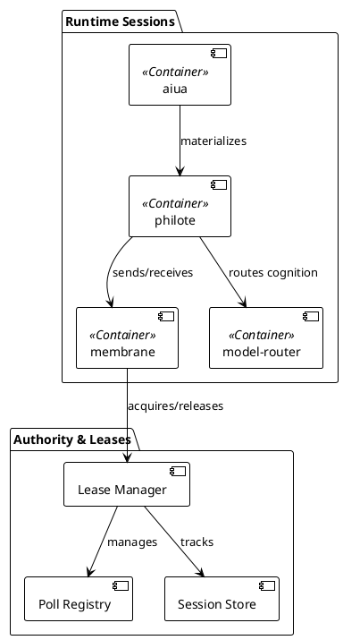
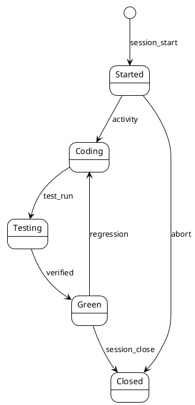

# Runtime Sessions Architecture

## Overview

The Philotic runtime is organized around **sessions** — contexts for agent execution with explicit lifecycle, state ownership, and recovery boundaries.

## Core Concepts

### Session

A **session** represents a bounded period of agent activity with:
- Unique identifier (`session:YYYY-MM-DD-{agent}`)
- Associated `seam` (where work happens)
- Associated `proposal` (what work achieves)
- Activity log (file edits, tests, verification)
- Verification level (`test-green`, `smoke-green`, `watched-live-green`)

### Lease

A **lease** is time-bounded authority for:
- Poll registration (e.g., Telegram bot polling)
- Resource access (e.g., model routing priority)
- State ownership (e.g., session checkpoint)

Leases prevent split-brain and enable graceful handoff.

### State Ownership Boundaries

| State Type | Canonical Owner | Derivation |
|------------|-----------------|------------|
| Session context | Graph (aiua) | Recovery checkpoints |
| Live routing | Hotel runtime | Materialized guests |
| Working state | Philote | Turn-local only |

## Session Lifecycle

## Verification Ladder

Every session must progress through verification:

1. **test-green** — Crate tests pass
2. **smoke-green** — Binary smoke tests pass
3. **watched-live-green** — Live run observed

No runtime change is "done" until watched-live confirmed.

## Implementation

### Key Crates

- `aiua/` — Hotel daemon, session authority
- `philote/` — Guest runtime, turn execution
- `membrane/` — Transport layer, lease framing
- `model-router/` — Cognitive routing

### Critical Files

- `aiua/src/session.rs` — Session lifecycle
- `aiua/src/lease.rs` — Lease management
- `membrane/src/framing.rs` — IPC framing

## Active Seams

- `seam:session-leases` — Lease protocol implementation
- `seam:runtime-authority-leases` — Authority delegation
- `seam:handoff-skill` — Graceful handoff

## Related Proposals

- [RUNTIME_AUTHORITY_LEASES_PROPOSAL](../architecture/RUNTIME_AUTHORITY_LEASES_PROPOSAL.md) — Lease design
- [AGENT_WORKFLOW_PROPOSAL](../architecture/AGENT_WORKFLOW_PROPOSAL.md) — Session workflow
- [AGENT_WORKSTREAM_TRACKING_PROPOSAL](../architecture/AGENT_WORKSTREAM_TRACKING_PROPOSAL.md) — Tracking integration

---

**Status:** Draft — extracting from implemented patterns  
**Next:** Add sequence diagrams for lease acquisition/handoff
