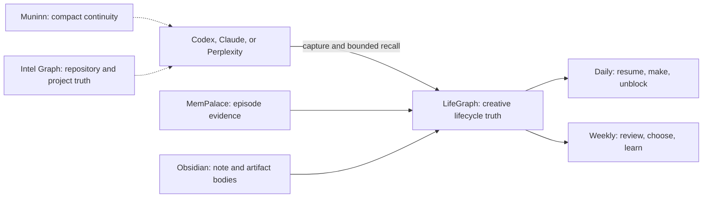

# Creative Learning Four-Week Pilot Playbook

## Purpose

Run one small, measurable creative-learning loop from capture through reuse.

The pilot is successful when organization increases motion:

- ideas receive concrete next actions
- experiments finish
- artifacts exist outside the planning conversation
- learning changes later work
- a paused thread becomes quick to resume

It is not successful merely because the graph contains more nodes. Taxonomy and
maintenance are costs. They earn their place only when they reduce
reconstruction or help create something.

## Pilot At A Glance

| Item | Pilot setting |
| --- | --- |
| Domain | `LifeGraph creative systems` |
| Active dates | 2026-07-26 through 2026-08-22 |
| Final review | 2026-08-23 |
| Daily brief | `12:00 UTC` daily; `08:00 America/New_York` during this pilot |
| Weekly review | Sunday `22:00 UTC`; `18:00 America/New_York` during this pilot |
| Daily effort | 2-10 minutes to choose or resume one action |
| Weekly effort | 20 minutes maximum, including classification and cleanup |
| Work in progress | One primary Idea or Experiment at a time |
| Primary delivery | Bounded brief or review delivered through Telegram |

The scheduler stores UTC expressions. The local hour may shift after daylight
saving time changes; that is accepted for this pilot unless it creates observed
friction.

## Operating Boundary



LifeGraph owns the structured creative lifecycle. Obsidian owns authored note
and artifact bodies. MemPalace supplies episodic evidence. Muninn supplies
compact continuity, not life truth. Intel Graph supplies repository structure,
decisions, and verification. Supporting context never promotes itself into
LifeGraph truth without the governed capture or confirmation path.

## Pilot Rules

1. Keep only one primary Idea or Experiment active.
2. Missing a day creates no catch-up debt. Resume from the current state.
3. Capture first; classify later when classification would interrupt flow.
4. Prefer a ten-minute action over a more elaborate plan.
5. Leave a re-entry handle whenever work stops.
6. Daily briefs and weekly reviews remain read-only.
7. Agents may propose LifeGraph writes; inferred commitments are never silently
   confirmed.
8. Do not add a second tracker, database, or spreadsheet for the pilot.
9. Spend no more than 20 minutes per week maintaining the system.
10. Count outcomes after kickoff, not the four deployment-smoke Ideas already in
    the graph.

## Quick Capture

Use the smallest prefix that preserves the thought:

```text
capture: a raw observation or open loop
question: something I want to understand
idea: a possible connection, approach, or creation
source: material worth returning to and why
experiment: if I do X, I expect Y; done when Z; stop by DATE
artifact: what I made or shared and where it lives
learning: what changed in my understanding, with the evidence that changed it
```

Good capture is short and recoverable. It does not need a complete ontology,
perfect title, or all relationships at capture time.

When an agent has enough provenance to suggest a connection, it may propose the
relationship. Semantic similarity alone is not a meaningful connection.

## The Daily Loop

The daily loop should take 2-10 minutes:

1. Read the bounded brief: one thread to resume, one small making action, and
   one blocker.
2. Choose one action that can begin in ten minutes. If none is appropriate,
   explicitly pause the suggested thread.
3. Do the action or create the smallest useful starting artifact.
4. Capture only the durable delta: a changed question, experiment result,
   artifact link, learning, or blocker.
5. Leave one re-entry handle:

   ```text
   Current state:
   Next physical action:
   Open question:
   Relevant artifact or source:
   ```

If recall is wrong, record the smallest honest usefulness signal: `useful`,
`stale`, `missing`, `noisy`, or `disconnected`. Fixing retrieval quality is
useful; reorganizing the whole system during creative time is not.

## The Weekly Loop

Stop after 20 minutes:

1. Read the automated `life.flywheel.review`.
2. Compare new activity with the kickoff baseline.
3. Close or pause the current experiment:
   - record an Artifact if something was made
   - record a Learning if evidence changed understanding
   - record the next action if the experiment continues
4. Choose one Idea with the best combination of energy, learning value, and
   finishability.
5. Define its smallest experiment:
   - no more than 90 minutes of initial effort
   - observable completion condition
   - explicit stop date within seven days
6. Make at most one system-maintenance correction. Put any other maintenance
   ideas in the inbox.
7. Update the compact scorecard and stop.

The automated review's current `ideas_advanced_proxy` is the number of Ideas in
the review window, not proof that those Ideas advanced. Its conversion rate is
Artifacts divided by Ideas in the same window, not cohort conversion. Treat both
as directional diagnostics. Use the manual definition below for pilot success.

An Idea has actually advanced only when it gains at least one of:

- a concrete next action
- a bounded Experiment
- a meaningful, provenance-backed Source or relationship that changes the work

## Four-Week Flight Plan

### Week 1: Establish Motion

**Dates:** 2026-07-26 through 2026-08-01

- Capture one real Question or Idea beyond the deployment-smoke fixtures.
- Select one primary Idea.
- Give it a concrete next action and a bounded Experiment.
- Record the approximate minutes needed to resume the thread.
- End the week with an explicit re-entry handle.

**Exit evidence:** one genuinely advanced Idea and one defined Experiment.

### Week 2: Test And Learn

**Dates:** 2026-08-02 through 2026-08-08

- Run the first Experiment.
- Attach at least one useful Source or Question.
- Record the result even if it disproves the Idea.
- Capture one reusable Learning.
- Decide to continue, change, or close the Idea.

**Exit evidence:** one completed Experiment and one evidence-backed Learning.

### Week 3: Make Something Real

**Dates:** 2026-08-09 through 2026-08-15

- Advance another Idea or refine the current one.
- Run the second bounded Experiment.
- Create, ship, perform, publish, or share one Artifact.
- Store the Artifact body in Obsidian or the relevant repository and link it
  from LifeGraph; do not duplicate the full body into every store.

**Exit evidence:** a second completed Experiment and one Artifact with a stable
reference.

### Week 4: Reuse And Simplify

**Dates:** 2026-08-16 through 2026-08-22

- Reuse an earlier Learning in a new decision, experiment, or creation.
- Advance enough additional Ideas to reach four for the pilot.
- Measure re-entry again.
- Remove or revise the single ritual causing the most friction.
- Complete the scorecard for the 2026-08-23 final review.

**Exit evidence:** one Learning reused, four Ideas advanced in total, and an
evidence-backed continue, adjust, or stop recommendation.

## Experiment Card

Use this compact shape:

```text
Idea:
Question:
Hypothesis: If I ..., then ...
Smallest test:
Done when:
Timebox: <= 90 minutes
Stop by:
Evidence to capture:
Possible artifact:
```

An Experiment is complete when its completion condition is met or the stop date
arrives and the observed result is captured. A surprising failure is a
completed experiment, not an administrative tragedy.

## Artifact Standard

An Artifact is something another person or future Jared can inspect, use,
experience, or continue. Examples include:

- a working prototype
- a published or shared note
- a drawing, recording, composition, or performance
- a tested workflow
- a decision memo
- a reusable prompt, skill, script, or design

A plan to make something is not yet the Artifact.

## Scorecard

Keep one running pilot note in Obsidian, preferably:

```text
Brain/Efforts/Ongoing/LifeGraph Creative Systems Pilot.md
```

The note is the human-readable review body. LifeGraph remains the structured
truth for Ideas, Experiments, Artifacts, Learnings, and their relationships.

| Measure | Kickoff | Week 1 | Week 2 | Week 3 | Week 4 |
| --- | ---: | ---: | ---: | ---: | ---: |
| New Ideas captured | 0 |  |  |  |  |
| Ideas actually advanced | 0 |  |  |  |  |
| Experiments completed | 0 |  |  |  |  |
| Artifacts created or shared | 0 |  |  |  |  |
| Learnings captured | 0 |  |  |  |  |
| Learnings reused | 0 |  |  |  |  |
| Useful connections accepted | 0 |  |  |  |  |
| Median re-entry minutes | measure |  |  |  |  |
| Maintenance minutes | 0 |  |  |  |  |
| Stale inbox items | 0 |  |  |  |  |

The first production review reported four Ideas and zero Experiments,
Artifacts, Learnings, and reuse edges. All four Ideas were deployment-smoke
fixtures. Preserve them as operational evidence, but subtract them from pilot
outcomes.

## Success Gate

At the final review, continue or expand the flywheel only if the evidence shows:

- at least four Ideas actually advanced
- at least two Experiments completed
- at least one Artifact created or shared
- at least one Learning reused in a later decision or creation
- median re-entry time decreased from the measured Week 1 baseline
- maintenance remained under 20 minutes each week
- at least three of the four weekly reviews were completed

Node count, note count, and captured-token count remain diagnostics. They do not
override the outcome gate.

## Recovery Rules

| If this happens | Do this |
| --- | --- |
| A day or week is missed | Do not catch up; resume the current lane and leave a new re-entry handle |
| Capture feels burdensome | Use one `capture:` line and defer classification |
| No Idea feels alive | Capture the best current Question |
| An Experiment exceeds 90 minutes | Split it at the next observable result |
| Week 3 has no Artifact | Shrink the Artifact until it can exist and be inspected |
| Recall is unhelpful | Record one usefulness signal and proceed from current truth |
| Maintenance exceeds 20 minutes | Stop maintenance and record the friction as pilot evidence |
| The automated metric looks flattering but false | Prefer manually verified advancement and artifact evidence |

## Cross-Agent Contract

Codex, Claude, Perplexity, and Philotic roles should follow the same compact
contract:

1. Retrieve one bounded context packet before resuming meaningful pilot work.
2. Treat Jared's current statement and observed artifact state as newer than
   recalled context.
3. Capture direct statements with provenance; propose rather than confirm
   inferred commitments.
4. Help move the current Idea toward an Experiment or Artifact before suggesting
   additional projects.
5. Keep long-form bodies in Obsidian or the relevant repository; keep structured
   state and links in LifeGraph.
6. At closeout, write only a compact continuity delta to Muninn:

   ```text
   Decision:
   Reality gap:
   Validation:
   Next seam:
   Operator preference:
   ```

## Final Review

On 2026-08-23, answer:

1. What was created that would not otherwise exist?
2. Which Learning changed a later decision or creation?
3. Did re-entry become faster?
4. Which suggestion or ritual created the most friction?
5. Was the maintenance cost worth the output?
6. Should the loop continue unchanged, continue with one adjustment, or stop?

Expand to another domain only when artifacts, learning reuse, or re-entry
improve without adding maintenance burden. Consider timezone-aware scheduling
only if the UTC cadence creates observed friction.

## Start Today

1. Treat the four smoke-test Ideas as baseline fixtures, not pilot progress.
2. Capture one real `question:` or `idea:`.
3. Take one ten-minute action and leave a re-entry handle.
